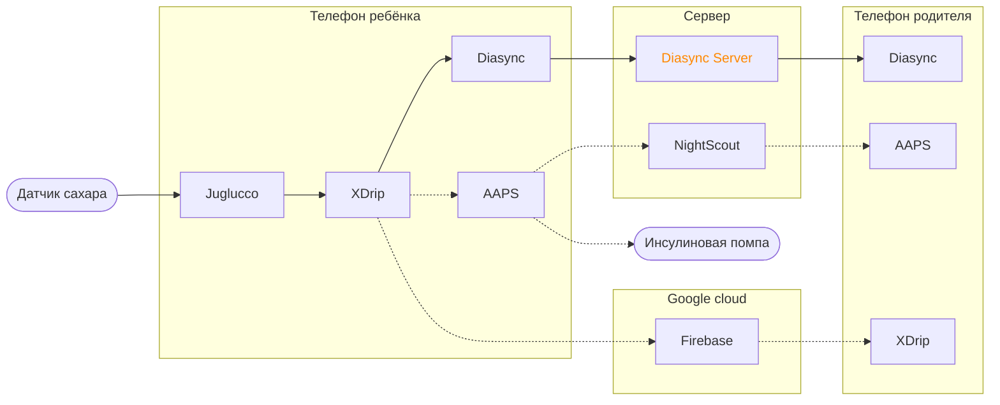

# Diasync server

Серверное часть системы мониторинга глюкозы Diasync.

## Пример схемы, в которое вписано это приложение

```mermaid
flowchart LR

    pump([Инсулиновая помпа])
    sensor([Датчик сахара])

    subgraph Google cloud
        firebase[Firebase]
    end

    subgraph Телефон ребёнка
        juglucco[Juglucco]
        xdrip_master[XDrip]
        aaps_master[AAPS]
        ds_master[Diasync]
    end
    subgraph Сервер
        ds_srv[Diasync Server]
        nightscout[NightScout]
    end
    subgraph Телефон родителя
        ds_slave[Diasync]
        aaps_slave[AAPS]
        xdrip_slave[XDrip]
    end

    sensor --> juglucco --> xdrip_master
    xdrip_master --> ds_master --> ds_srv --> ds_slave
    xdrip_master -.-> aaps_master -.-> nightscout -.-> aaps_slave
    xdrip_master -.-> firebase -.-> xdrip_slave
    aaps_master -.-> pump
    
    style ds_srv color:#FF8800
    
    click juglucco href "https://www.juggluco.nl/"
    click firebase href "https://firebase.google.com/"
    click xdrip_master,xdrip_slave href "https://github.com/NightscoutFoundation/xDrip"
    click aaps_master,aaps_slave href "https://github.com/nightscout/AndroidAPS"
    click ds_master,ds_slave href "https://github.com/illepidus/diasync"
    click nightscout href "https://github.com/nightscout/cgm-remote-monitor"
```
