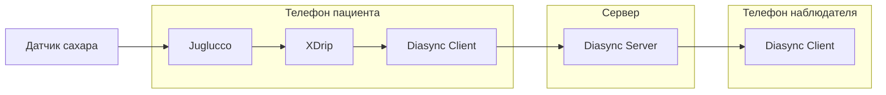

# Diasync server

Серверное часть системы мониторинга глюкозы Diasync.

## Схема

```mermaid
flowchart LR
    sensor[Датчик сахара]

    subgraph Телефон пациента
        juglucco[Juglucco]
        xdrip_cli[XDrip]
        ds_cli_master[Diasync Client]
    end
    subgraph Сервер
        ds_srv[Diasync Server]
    end
    subgraph Телефон наблюдателя
        ds_cli_slave[Diasync Client]
    end
    
    sensor-->juglucco-->xdrip_cli-->ds_cli_master-->ds_srv-->ds_cli_slave
```
